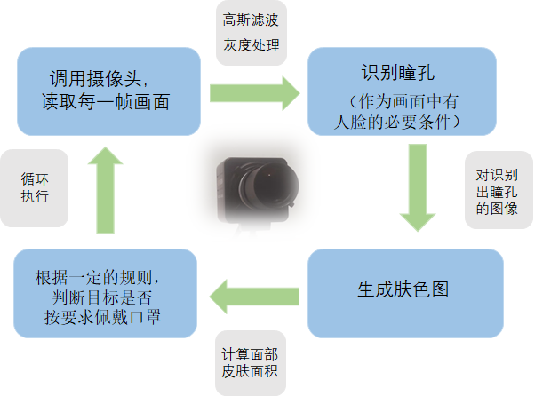
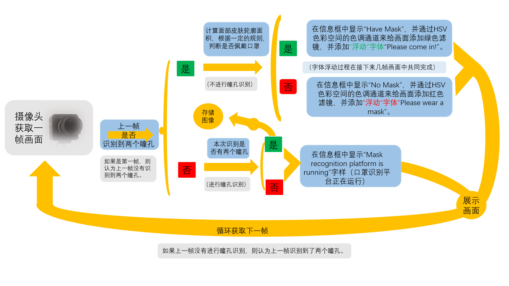

# 基于 OpenCV 的口罩实时监测系统

## 项目概述

口罩实时监测系统是基于Python与计算机视觉库OpenCV实现的，主要面向需要进行口罩监测的场景。该系统具备本地运行、实时监测的功能，专注于识别口罩佩戴情况，并根据识别情况展示相应的动画，实用性强。项目最终打包为exe程序形式，为非技术人员的使用提供了便利。

## 功能介绍

### 实时监测功能

- **目标**：实时监测目标群体的口罩佩戴情况，为需要佩戴口罩的场景提供技术支持。
- **工作原理**：程序持续对画面中的有效人脸信息进行捕捉，当捕捉到被识别对象后，进而对其是否佩戴口罩进行检测。
    - **佩戴口罩**：画面出现绿色浮动字体“Please come in!”（请进），并应用绿色滤镜。
    - **未佩戴口罩**：画面出现红色浮动字体“Please wear a mask”（请佩戴好口罩），并应用红色警告滤镜。
    - **未识别到有效人脸信息**：信息框中显示字体“Mask recognition platform is running”（口罩识别平台正在运行），并持续寻找瞳孔特征。

### 存储功能

- **功能描述**：将拍摄到的有效图片（每个被识别到的人脸）自动存储在本地，以便事后调取相关记录。
- **文件名**：存储时以时间命名。

## 项目逻辑

### 项目基本逻辑



### 程序逻辑图



- 每成功识别到一次瞳孔到下一次准备识别瞳孔之间，大概有5秒的时间间隔，为被识别者通过门禁留出一定合理的时间。
- 每次识别成功后开始播放相应的浮动字体，浮动字体从窗口下方移动到窗口上方后，1-2秒后开始下一次识别。
- 1-2秒后，将表示上一次是否识别到两个瞳孔的变量，强行调整为上一次没有识别到两个瞳孔，以便继续识别。

## 技术实现

- **开发环境**：
    - 开发工具：PyCharm
    - 开发语言：Python
- **核心库**：OpenCV

## 使用方法

### 安装依赖

确保已安装Python和OpenCV库。如未安装，请运行以下命令：

```bash
pip install opencv-contrib-python
```

### 运行程序

1. 将项目文件下载并解压到本地目录。
2. 打开命令行工具，导航到项目目录。
3. 运行以下命令启动程序：

```bash
python image_process_pipeline.py
```

## 注意事项

1. **环境要求**：确保系统支持 Python 及 OpenCV 库，系统运行时，确保摄像头已正确连接并可用，请保持摄像头视野清晰，避免遮挡和强光干扰。
2. **隐私保护**：本系统仅用于需要口罩监测的场景，请确保在合法合规的前提下使用，不侵犯他人隐私。
3. **性能优化**：由于系统基于颜色和形状特征进行口罩识别，可能存在误判情况。在复杂环境下，建议结合深度学习模型提高识别准确率。

---

本项目旨在提供一款简洁、实用的口罩实时监测系统，为需要佩戴口罩的场景提供技术支持。如有任何问题或建议，请随时联系项目团队。